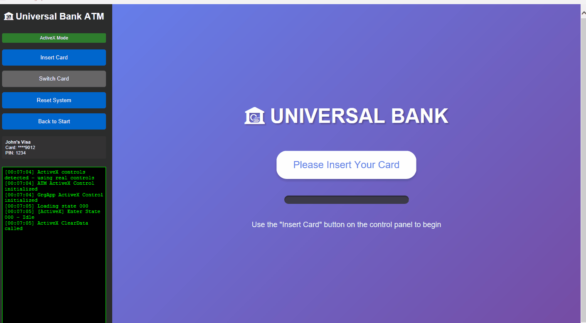

# ATM Banking System Simulator

[](https://opensource.org/licenses/MIT)
[](https://www.microsoft.com/windows)
[](https://en.wikipedia.org/wiki/HTML_Application)

A comprehensive ATM (Automated Teller Machine) banking system simulator built with HTML/JavaScript for Windows HTA (HTML Application) environment. This project implements a complete ATM state machine with realistic transaction workflows, security features, and device simulations.



## 📋 Table of Contents

- [Overview](#overview)
- [Features](#features)
- [Transaction Workflows](#transaction-workflows)
- [Project Structure](#project-structure)
- [NDC States](#ndc-states)
- [Installation](#installation)
- [Usage](#usage)
- [Testing](#testing)
- [Technical Details](#technical-details)
- [Security](#security)
- [Contributing](#contributing)
- [License](#license)
- [Acknowledgments](#acknowledgments)

## 🏦 Overview

This simulator provides a realistic ATM banking experience with complete transaction flows, following industry-standard NDC (NCR Direct Connect) state machine architecture. Built for testing, training, and educational purposes, it simulates all major ATM operations including cash withdrawals, balance inquiries, and error handling scenarios.

**Key Technologies:**
- HTML/CSS/JavaScript
- Windows HTA (HTML Application)
- ISO-8583 message simulation
- NDC state machine architecture

## ✨ Features

### 💳 Core Banking Transactions

- **Cash Withdrawal**
  - Full workflow from card insertion to cash dispensing
  - Amount validation (£10-£500, multiples of £5)
  - Note breakdown calculation (£20, £10, £5 notes)
  
- **Balance Inquiry**
  - Real-time account balance display
  - Available balance vs current balance
  - Daily withdrawal limit tracking
  
- **Fast Cash**
  - Quick withdrawal with preset amounts
  - Pre-configured options: £20, £40, £60, £100
  - Expedited processing flow
  
- **Mini Statement**
  - Recent transaction history
  - Transaction details with dates and amounts
  - Running balance display

### 🔒 Security Features

| Feature | Description |
|---------|-------------|
| PIN Masking | PIN displayed as dots (●●●●) during entry |
| Attempt Limit | 3 incorrect attempts → card retention |
| Session Timeout | 30-60 second idle timeouts per state |
| Daily Limits | £500 maximum daily withdrawal |
| Balance Check | Validates available funds before dispensing |
| Card Retention | Security violation triggers card capture |

### 🖥️ Device Simulations

#### Cash Dispenser Module (CDM)
- Note counting and selection
- Dispensing animation with progress tracking
- Jam detection and error handling
- Cash retraction after 30-second timeout
- Note breakdown by denomination

#### ID Card Reader (IDC)
- Card insertion detection
- Magnetic stripe data reading
- Card validation and verification
- Ejection control
- Card retention capability

#### PIN Pad
- Secure PIN entry with masking
- Numeric keypad (0-9)
- Function keys (Cancel, Clear, Enter)
- Input validation
- Timeout handling

#### Network Interface
- ISO-8583 message formatting
- Host communication simulation
- Response code handling (00, 51, 61, 91)
- Transaction authorization
- Network timeout simulation

#### Receipt Printer
- Transaction receipt generation
- Receipt formatting
- Print job simulation
- Optional receipt feature

## 🔄 Transaction Workflows

### Cash Withdrawal Flow
```
000 (Idle) 
  → 136 (Card Read) 
  → 137 (PIN Entry) 
  → 141 (Transaction Selection) 
  → 395 (Amount Entry) 
  → 789 (Host Authorization) 
  → 907 (Cash Dispense) 
  → 909 (End Transaction)
```

**Steps:**
1. Customer inserts card
2. System reads card data
3. Customer enters 4-digit PIN
4. Customer selects "Cash Withdrawal"
5. Customer enters withdrawal amount
6. System contacts host for authorization
7. Cash is dispensed with note breakdown
8. Receipt printed (optional)
9. Card ejected and transaction complete

### Balance Inquiry Flow
```
000 (Idle) 
  → 136 (Card Read) 
  → 137 (PIN Entry) 
  → 141 (Transaction Selection) 
  → 789 (Host Authorization) 
  → 766 (Information Display) 
  → 909 (End Transaction)
```

### Fast Cash Flow
```
000 (Idle) 
  → 136 (Card Read) 
  → 137 (PIN Entry) 
  → 141 (Transaction Selection) 
  → 395 (Amount Entry - Preset) 
  → 789 (Host Authorization) 
  → 907 (Cash Dispense) 
  → 909 (End Transaction)
```

## 📁 Project Structure

```
ATM-Banking-System/
│
├── index.hta                 # Main application container
│
├── _css/
│   └── grg_style.css        # ATM interface styling
│
├── _js/
│   └── StateProcessor.js    # State management utilities
│
├── 000/                     # State folders (one per state)
│   └── 000.html            # State 000 - Idle
├── 136/
│   └── 136.html            # State 136 - Card Read
├── 137/
│   └── 137.html            # State 137 - PIN Entry
├── 141/
│   └── 141.html            # State 141 - Transaction Selection
├── 395/
│   └── 395.html            # State 395 - Amount Entry
├── 789/
│   └── 789.html            # State 789 - Authorization
├── 907/
│   └── 907.html            # State 907 - Cash Dispense
├── 909/
│   └── 909.html            # State 909 - End Transaction
├── 766/
│   └── 766.html            # State 766 - Information Display
├── 924/
│   └── 924.html            # State 924 - Error Handling
│
├── reserved/
│   └── controlLoad.html    # Control frame loader
│
├── docs/                    # Documentation and images
│   └── images/
│
├── LICENSE                  # MIT License
└── README.md               # This file
```

## 🎯 NDC States

| State | Name | Purpose | Timeout |
|-------|------|---------|---------|
| 000 | Idle | Attract loop, waiting for card insertion | None |
| 136 | Card Read | Card data reading and validation | 10s |
| 137 | PIN Entry | Secure PIN input with masking | 30s |
| 141 | Transaction Selection | Main menu with transaction options | 60s |
| 395 | Amount Entry | Withdrawal amount input with validation | 45s |
| 789 | Authorization | Host communication and approval | 30s |
| 907 | Dispense | Cash dispensing with note breakdown | 30s |
| 909 | End Transaction | Transaction completion and card return | 30s |
| 766 | Display Information | Balance and statement display | 60s |
| 924 | Device Error | Comprehensive error handling | 45s |

## 🚀 Installation

### Prerequisites
- **Operating System**: Windows 7 or later
- **Browser Engine**: Internet Explorer engine (built into Windows)
- **Screen Resolution**: Minimum 1024x768

### Steps

1. **Clone the repository**
   ```bash
   git clone https://github.com/Tshimangadzostephen/ATM-Banking-System.git
   cd ATM-Banking-System
   ```

2. **Verify file structure**
   ```bash
   # Ensure all state folders (000-924) exist
   # Ensure _css and _js folders are present
   ```

3. **Launch the application**
   - Double-click `index.hta`
   - Or right-click → Open with → Microsoft HTML Application Host

## 💻 Usage

### Basic Operation

1. **Start the ATM**
   - Double-click `index.hta`
   - ATM displays idle/attract screen (State 000)

2. **Test Card Insertion**
   - Open browser console (F12)
   - Type: `insertCard()`
   - System transitions to PIN entry

3. **Enter PIN**
   - Use on-screen keypad or type "1234"
   - Press Enter or click "ENTER" button

4. **Select Transaction**
   - Choose from available options:
     - Cash Withdrawal
     - Fast Cash
     - Balance Inquiry
     - Mini Statement

5. **Complete Transaction**
   - Follow on-screen prompts
   - Take cash (if withdrawal)
   - Remove card when prompted

### Console Commands

Open browser console (F12) and use these commands for testing:

```javascript
// Simulate card insertion
insertCard();

// Simulate card removal
removeCard();

// Press function keys
pressKey('F1');    // Usually "Confirm" or primary action
pressKey('F2');    // Usually secondary action
pressKey('F3');    // Usually tertiary action
pressKey('F4');    // Usually "Cancel"
pressKey('CANCEL');
pressKey('CLEAR');
pressKey('ENTER');

// Jump to specific state
GrgApp.LoadState('000');  // Idle
GrgApp.LoadState('137');  // PIN Entry
GrgApp.LoadState('141');  // Menu

// Check current state
GrgApp.GetCurrentState();

// View transaction data
GrgDataPool.GetTransactionData();

// Set test data
GrgDataPool.SetData('Balance', '1500.00');
GrgDataPool.SetData('CustomerName', 'JOHN DOE');

// Clear all data
GrgDataPool.ClearData();
```

## 🧪 Testing

### Test Scenarios

#### 1. Successful Withdrawal
```
✓ Insert card
✓ Enter PIN "1234" (or any ending in "4")
✓ Select "Cash Withdrawal"
✓ Enter amount £40
✓ Authorization approved (response code 00)
✓ Cash dispensed (2×£20 notes)
✓ Take cash within 30 seconds
✓ Remove card
✓ Return to idle
```

#### 2. PIN Failure
```
✓ Insert card
✓ Enter incorrect PIN (attempt 1)
✓ Error message displayed
✓ Enter incorrect PIN (attempt 2)
✓ Warning: 1 attempt remaining
✓ Enter incorrect PIN (attempt 3)
✓ Card retained
✓ Error state (924) with reference number
```

#### 3. Insufficient Funds
```
✓ Insert card
✓ Enter PIN "1234"
✓ Select "Cash Withdrawal"
✓ Enter amount £2000 (exceeds balance)
✓ Authorization declined (response code 51)
✓ Error message: "Insufficient funds"
✓ Option to try different amount
✓ Cancel transaction
```

#### 4. Session Timeout
```
✓ Insert card
✓ Enter PIN "1234"
✓ Select "Cash Withdrawal"
✓ Wait 45 seconds without entering amount
✓ Timeout message displayed
✓ Card ejected
✓ Return to idle
```

#### 5. Cash Not Taken
```
✓ Complete withdrawal flow
✓ Cash dispensed
✓ Wait 30 seconds without taking cash
✓ Cash retracted
✓ Account not debited
✓ Error state with instructions
```

### Test Data

Default test data loaded in system:

```javascript
{
  AccountNumber: "12345678",
  SortCode: "12-34-56",
  CustomerName: "JOHN DOE",
  CardNumber: "1234567890123456",
  CardType: "DEBIT",
  Balance: "1500.00",
  DailyLimit: "500.00",
  DailyUsed: "0.00",
  PIN: "1234"  // Test PIN
}
```

### Valid Test PINs
- `1234` - Always accepted
- Any 4-digit PIN ending in `4` (e.g., `5554`, `9874`)

### Response Codes
| Code | Description | Scenario |
|------|-------------|----------|
| 00 | Approved | Sufficient funds, within limits |
| 51 | Insufficient funds | Amount exceeds balance |
| 61 | Exceeds limit | Amount exceeds daily limit |
| 91 | System malfunction | Network/system error |

## 🔧 Technical Details

### Architecture

The simulator follows a **state-based architecture** where each screen is a separate state with its own HTML file. State transitions are managed by the parent `index.hta` container.

```
┌─────────────────────────────────────┐
│         index.hta (Container)        │
│  ┌─────────────────────────────┐   │
│  │   Mock Controllers:          │   │
│  │   - GrgApp (state mgmt)      │   │
│  │   - GrgDataPool (data)       │   │
│  │   - GrgNetwork (messaging)   │   │
│  └─────────────────────────────┘   │
│              ▼                       │
│  ┌─────────────────────────────┐   │
│  │   <iframe id="stateFrame">   │   │
│  │   Current State HTML         │   │
│  │   (000.html, 137.html, etc.) │   │
│  └─────────────────────────────┘   │
└─────────────────────────────────────┘
```

### Mock Controllers

#### GrgApp
```javascript
{
  LogEvent(msg)           // Log events to console
  LoadState(stateNumber)  // Transition to new state
  GetCurrentState()       // Get current state number
}
```

#### GrgDataPool
```javascript
{
  SetData(key, value)     // Store transaction data
  GetData(key)            // Retrieve data by key
  ClearData()             // Clear all data
  GetTransactionData()    // Get all data as object
}
```

#### GrgNetwork
```javascript
{
  SendMessage(msg)        // Send ISO-8583 message
  Connect()               // Establish connection
  Disconnect()            // Close connection
  GetStatus()             // Check connection status
}
```

### State HTML Template

Each state follows this structure:

```html
<!DOCTYPE html>
<html>
<head>
    <title>State XXX - Name</title>
    <link rel="stylesheet" href="../_css/grg_style.css">
    <script src="../_js/StateProcessor.js"></script>
</head>
<body onload="OnStateEntry()">
    <div class="screen-layout">
        <div class="instruction-area" id="InstructionText">
            [State-specific instructions]
        </div>

        <div class="content-area">
            [State-specific UI elements]
        </div>

        <div class="function-keys">
            [FDK buttons as needed]
        </div>
    </div>

    <script>
        var GrgApp = parent.GetWebCtrl("GrgApp");
        var GrgDataPool = parent.GetWebCtrl("GrgDataPool");

        function OnStateEntry() {
            GrgApp.LogEvent("Enter State XXX");
            // State initialization
        }

        function OnTimeout() {
            // Timeout handling
            GrgApp.LoadState("000");
        }
        
        function OnHardwareEvent(eventType, data) {
            // Handle hardware events
        }
    </script>
</body>
</html>
```

### ISO-8583 Message Format

#### Authorization Request (0100)
```javascript
{
  MTI: "0100",                      // Message Type Indicator
  PAN: "1234567890123456",          // Primary Account Number
  ProcessingCode: "010000",         // Transaction type code
  Amount: "000000010000",           // Amount (£100.00)
  STAN: "123456",                   // System Trace Audit Number
  LocalTime: "143022",              // HHmmss
  LocalDate: "1121",                // MMDD
  ResponseCode: ""                  // Filled by host
}
```

#### Authorization Response (1100)
```javascript
{
  MTI: "1100",                      // Response message
  PAN: "1234567890123456",
  ProcessingCode: "010000",
  Amount: "000000010000",
  STAN: "123456",
  LocalTime: "143023",
  LocalDate: "1121",
  ResponseCode: "00",               // 00 = Approved
  AvailableBalance: "000000140000"  // £1400.00
}
```

### CSS Class Reference

Common CSS classes used across states:

```css
.screen-layout          /* Main container */
.instruction-area       /* Top instruction text */
.content-area          /* Main content area */
.function-keys         /* Bottom button area */

.success               /* Green success text */
.error                 /* Red error text */
.warning               /* Orange warning text */
.processing            /* Blue processing text */

.pin-dots              /* PIN masking display */
.keypad                /* Numeric keypad */
.menu-option           /* Menu buttons */
.amount-button         /* Amount selection buttons */
```

## 🔐 Security

### ⚠️ Important Security Notice

**This is a simulator for educational and testing purposes only.**

- ❌ **Not for production use**
- ❌ **No real banking connections**
- ❌ **No actual financial transactions**
- ❌ **PIN "encryption" uses basic Base64 (NOT SECURE)**

### Security Features (For Simulation)

The simulator implements realistic security features for demonstration:

1. **PIN Protection**
   - Visual masking (displayed as ●●●●)
   - Limited attempts (3 maximum)
   - Card retention on failure

2. **Session Management**
   - Automatic timeouts
   - Forced card ejection
   - Data clearing between sessions

3. **Transaction Limits**
   - Daily withdrawal limits
   - Maximum transaction amounts
   - Balance validation

4. **Audit Trail**
   - All actions logged to console
   - Transaction IDs generated
   - Reference numbers for errors

### For Production Use

If adapting for production, implement:
- ✅ Real PIN encryption (3DES, AES)
- ✅ SSL/TLS for network communication
- ✅ Hardware security modules (HSM)
- ✅ PCI DSS compliance
- ✅ Database encryption
- ✅ Proper authentication
- ✅ Security monitoring and alerts

## 🤝 Contributing

Contributions are welcome! Please follow these guidelines:

### How to Contribute

1. **Fork the repository**
   ```bash
   git clone https://github.com/yourusername/ATM-Banking-System.git
   ```

2. **Create a feature branch**
   ```bash
   git checkout -b feature/AmazingFeature
   ```

3. **Make your changes**
   - Follow existing code style
   - Update documentation
   - Add tests if applicable

4. **Commit your changes**
   ```bash
   git commit -m 'Add some AmazingFeature'
   ```

5. **Push to the branch**
   ```bash
   git push origin feature/AmazingFeature
   ```

6. **Open a Pull Request**

### Contribution Ideas

- 🎨 Additional ATM themes/skins
- 🌍 Multi-language support
- 💳 Additional card types (credit, prepaid)
- 📱 Mobile responsive design
- 🔧 More error scenarios
- 📊 Enhanced reporting features
- 🎯 Unit test coverage
- 📖 Additional documentation

### Code Style

- Use consistent indentation (2 or 4 spaces)
- Add comments for complex logic
- Follow existing naming conventions
- Keep functions focused and concise
- Update README for new features

## 📄 License

This project is licensed under the **MIT License** - see the [LICENSE](LICENSE) file for details.

```
MIT License

Copyright (c) 2024 [Your Name]

Permission is hereby granted, free of charge, to any person obtaining a copy
of this software and associated documentation files (the "Software"), to deal
in the Software without restriction, including without limitation the rights
to use, copy, modify, merge, publish, distribute, sublicense, and/or sell
copies of the Software, and to permit persons to whom the Software is
furnished to do so, subject to the following conditions:

The above copyright notice and this permission notice shall be included in all
copies or substantial portions of the Software.

THE SOFTWARE IS PROVIDED "AS IS", WITHOUT WARRANTY OF ANY KIND, EXPRESS OR
IMPLIED, INCLUDING BUT NOT LIMITED TO THE WARRANTIES OF MERCHANTABILITY,
FITNESS FOR A PARTICULAR PURPOSE AND NONINFRINGEMENT.
```

## 🙏 Acknowledgments

- **NCR Corporation** - NDC protocol and state machine architecture
- **ISO** - ISO-8583 financial transaction messaging standard
- **GRG Banking** - Equipment terminology and conventions
- **Windows HTA** - Application platform and capabilities

## 📧 Contact & Support

- **Email**: tshimangadzostephen@icloud.com

## 🗺️ Roadmap

### Version 1.0 (Current)
- ✅ Core transaction flows
- ✅ 10 NDC states
- ✅ PIN security
- ✅ Cash dispensing
- ✅ Error handling

### Version 1.1 (Planned)
- ⏳ Receipt printing improvements
- ⏳ Enhanced logging
- ⏳ More test scenarios
- ⏳ Performance optimizations

### Version 2.0 (Future)
- 📋 Multi-language support
- 📋 Additional transaction types
- 📋 Advanced reporting
- 📋 Configuration options

## 📚 Additional Resources

- [NDC Protocol Documentation](https://www.ncr.com)
- [ISO-8583 Standard](https://www.iso.org/standard/31628.html)
- [ATM Industry Association](https://www.atmia.com)
- [Windows HTA Documentation](https://docs.microsoft.com/en-us/previous-versions/ms536496(v=vs.85))

---

**⭐ Star this repository if you find it useful!**

**Built with ❤️ for education and testing purposes**

This simulator provides a realistic ATM banking experience with complete transaction flows, following industry-standard NDC (NCR Direct Connect) state machine architecture. Built for testing, training, and educational purposes.

## ✨ Key Features

### Core Banking Transactions
- **Cash Withdrawal**: Full workflow from card insertion to cash dispensing
- **Balance Inquiry**: Real-time account balance checking
- **Fast Cash**: Quick withdrawal with preset amounts (£20, £40, £60, £100)
- **Mini Statement**: Display recent transaction history

### Transaction Workflows
1. **Cash Withdrawal Flow**: 
   - States: 000 → 136 → 137 → 141 → 395 → 789 → 907 → 909
   - Card insertion → PIN entry → Menu → Amount selection → Host authorization → Cash dispense → Complete

2. **Balance Inquiry Flow**:
   - States: 000 → 136 → 137 → 141 → 789 → 766 → 909
   - Card insertion → PIN entry → Menu → Host request → Balance display → Complete

3. **Fast Cash Flow**:
   - States: 000 → 136 → 137 → 141 → 395 → 789 → 907 → 909
   - Quick amount selection with expedited processing

### Security Features
- ✅ PIN masking during entry (displayed as dots)
- ✅ 3-attempt limit with automatic card retention
- ✅ Session timeouts (30 seconds idle timeout)
- ✅ Transaction limits (£500 daily withdrawal limit)
- ✅ Balance validation before dispensing
- ✅ Secure card ejection procedures

### Device Simulations
- **CDM (Cash Dispenser Module)**: Note counting, dispensing, jam detection, cash retraction
- **IDC (ID Card Reader)**: Card insertion/ejection, magnetic stripe reading, data validation
- **PIN Pad**: Encrypted PIN entry, numeric keypad, function keys (Cancel, Clear, Enter)
- **Receipt Printer**: Transaction receipt formatting and printing
- **Network Interface**: ISO-8583 message simulation with response codes

## 📁 Project Structure

```
ATM-Banking-System/
├── index.hta                 # Main HTA application container
├── _css/
│   └── grg_style.css        # ATM interface styling
├── _js/
│   └── StateProcessor.js    # State management utilities
├── 000/                     # State 000 - Idle (Attract loop)
│   └── 000.html
├── 136/                     # State 136 - Card Read
│   └── 136.html
├── 137/                     # State 137 - PIN Entry
│   └── 137.html
├── 141/                     # State 141 - Transaction Selection
│   └── 141.html
├── 395/                     # State 395 - Amount Entry
│   └── 395.html
├── 789/                     # State 789 - Authorization
│   └── 789.html
├── 907/                     # State 907 - Cash Dispense
│   └── 907.html
├── 909/                     # State 909 - End Transaction
│   └── 909.html
├── 766/                     # State 766 - Information Display
│   └── 766.html
└── 924/                     # State 924 - Error Handling
    └── 924.html
```

## 🎯 Implemented NDC States

| State | Name | Purpose |
|-------|------|---------|
| 000 | Idle | Attract loop, waiting for card insertion |
| 136 | Card Read | Card data reading and validation |
| 137 | PIN Entry | Secure PIN input with masking |
| 141 | Transaction Selection | Main menu with transaction options |
| 395 | Amount Entry | Withdrawal amount input with validation |
| 789 | Authorization | Host communication and approval |
| 907 | Dispense | Cash dispensing with note breakdown |
| 909 | End Transaction | Transaction completion and card return |
| 766 | Display Information | Balance and statement display |
| 924 | Device Error | Comprehensive error handling |

## 🔧 Technical Implementation

### Mock Controllers
- **GrgApp**: State management and logging
- **GrgDataPool**: Transaction data storage and retrieval
- **GrgNetwork**: ISO-8583 message simulation with realistic response codes

### ISO-8583 Messaging
```javascript
// Transaction Authorization Message (0100)
{
    MTI: "0100",
    PAN: "1234567890123456",
    ProcessingCode: "000000",
    Amount: "000000010000",
    STAN: "123456",
    ResponseCode: "00" // Approved
}
```

### Response Codes
- `00` - Approved
- `51` - Insufficient funds
- `61` - Exceeds withdrawal limit
- `91` - System malfunction

## 🚀 Getting Started

### Prerequisites
- Windows operating system (for HTA support)
- Internet Explorer engine (built into Windows)

### Installation
1. Clone the repository:
   ```bash
   git clone https://github.com/yourusername/ATM-Banking-System.git
   ```

2. Navigate to the project directory:
   ```bash
   cd ATM-Banking-System
   ```

3. Double-click `index.hta` to launch the ATM simulator

### Testing
Open browser console (F12) and use these commands:
```javascript
// Simulate card insertion
insertCard();

// Simulate card removal
removeCard();

// Press function keys
pressKey('F1');

// Jump to specific state
GrgApp.LoadState('141');
```

## 🎨 User Interface

The ATM interface features:
- Professional gradient backgrounds (blue theme)
- Animated card slot and progress indicators
- Responsive button interactions with hover effects
- Clear instruction areas and transaction summaries
- Real-time status updates and error messages

## 📝 State HTML Structure

Each state follows a consistent pattern:
```html
<!DOCTYPE html>
<html>
<head>
    <link rel="stylesheet" href="../_css/grg_style.css">
    <script src="../_js/StateProcessor.js"></script>
</head>
<body onload="OnStateEntry()">
    <div class="screen-layout">
        <div class="instruction-area">Instructions</div>
        <div class="content-area">UI Elements</div>
        <div class="function-keys">FDK Buttons</div>
    </div>
    <script>
        var GrgApp = parent.GetWebCtrl("GrgApp");
        var GrgDataPool = parent.GetWebCtrl("GrgDataPool");
        
        function OnStateEntry() {
            // State initialization
        }
        
        function OnTimeout() {
            // Timeout handling
        }
    </script>
</body>
</html>
```

## 🧪 Test Scenarios

### Successful Withdrawal
1. Insert card (auto-transitions to PIN entry)
2. Enter PIN "1234" (or any ending in "4")
3. Select "Cash Withdrawal"
4. Enter amount (£10-£500, multiples of £5)
5. Approve transaction
6. Take cash within 30 seconds
7. Remove card

### PIN Failure Scenario
1. Insert card
2. Enter incorrect PIN (3 attempts)
3. Card is retained for security
4. Error state displayed with reference number

### Insufficient Funds
1. Complete withdrawal flow
2. Request amount exceeding balance
3. Transaction declined
4. Option to try different amount

## 🔐 Security Considerations

⚠️ **Note**: This is a simulator for testing/educational purposes only:
- PIN "encryption" uses basic Base64 encoding (NOT secure for production)
- No real banking connections
- Mock data only
- For demonstration and training purposes

## 📄 License

This project is licensed under the MIT License - see the LICENSE file for details.

## 🤝 Contributing

Contributions are welcome! Please feel free to submit a Pull Request.

1. Fork the project
2. Create your feature branch (`git checkout -b feature/AmazingFeature`)
3. Commit your changes (`git commit -m 'Add some AmazingFeature'`)
4. Push to the branch (`git push origin feature/AmazingFeature`)
5. Open a Pull Request

## 📧 Contact

Project Link: [https://github.com/Tshimangadzostephen/ATM-Banking-System](https://github.com/Tshimangadzostephen/ATM-Banking-System)

## 🙏 Acknowledgments

- NDC state machine architecture standards
- ISO-8583 financial transaction messaging
- GRG Banking Equipment terminology and conventions

---

**Built for educational and testing purposes** | **Not for production use**
